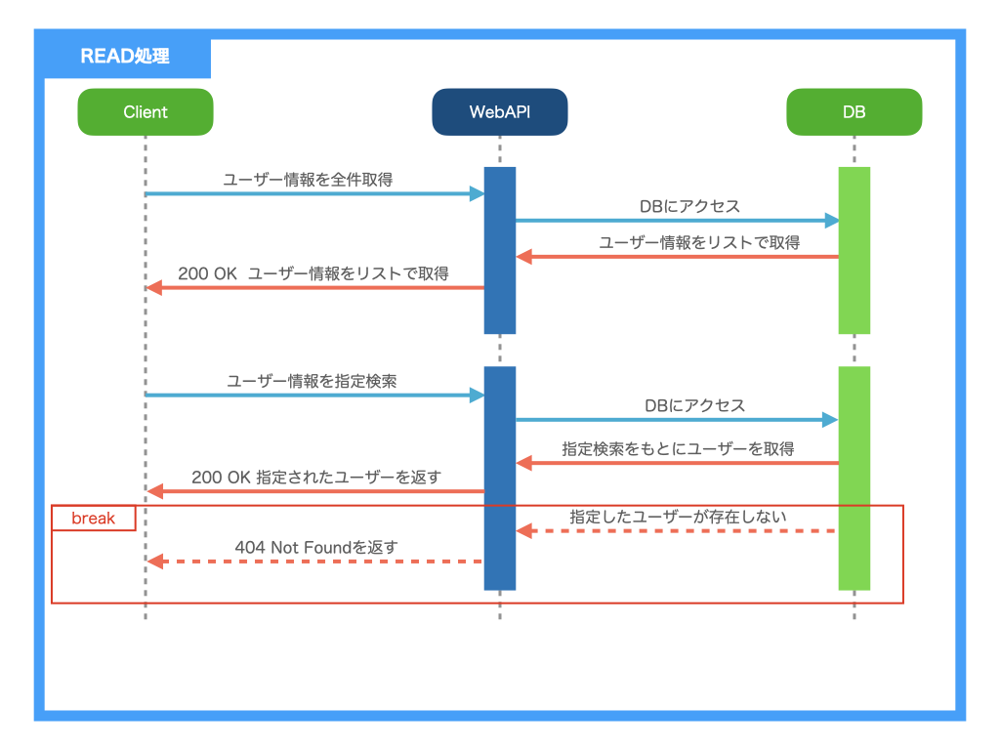
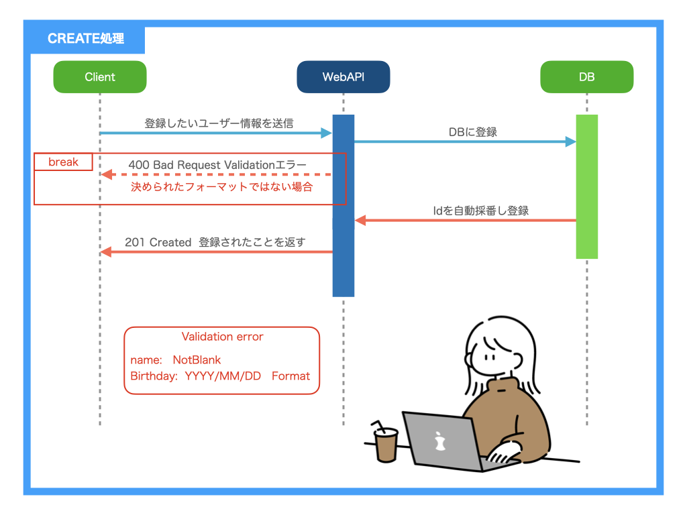
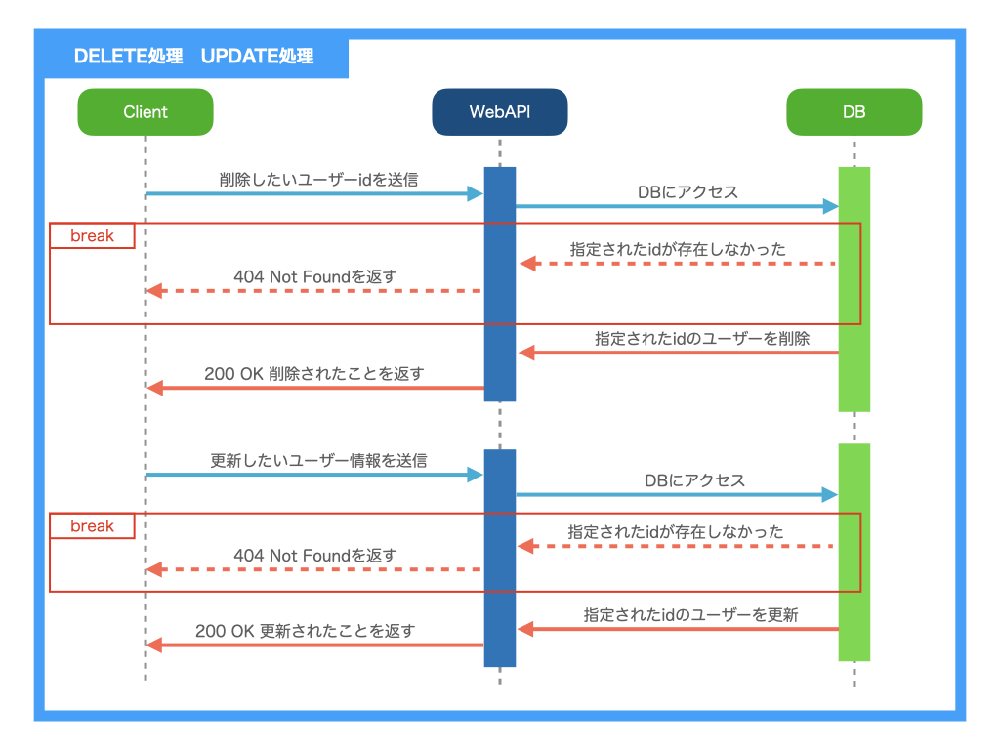

# 使用技術一覧


AWSについては学習中になりますので実装次第更新します。

***

# サービス概要

* 名前と誕生日をセットにidで紐づけして登録します。登録の際idは自動で採番されます。
* ユーザーを全件JSON形式で取得します。また、名前に入力した文字が含まれる人の検索やidを指定して検索する条件取得ができます。
* idを指定しそのユーザーの名前と誕生日を更新できます。
* idを指定しそのユーザーを削除することができます。

<br>
<br>
<br>

# 作成にあたって

色々なAPIを考え挑戦しようと思いましたが、__基本の「き」__ ができてこそ！  
と思い授業に近い形で作成しました。  
このAPIを他の生徒さん達が見て参考になれば！という思いで作成しました。

<br>
<br>

# セットアップについて

### 必要環境

<br>

* Java 17
* MySQL
* Docker 3.8

<br>

# ローカルでのアプリケーション起動手順

1.プロジェクトをクローンします。

```text
 git clone https://github.com/u-1pena/assignment10.git
```

2.Dockerを起動

```text
docker compose up -d
```

3.SpringBootを起動

```text
./gradlew bootRun
```

ブラウザにてcurlコマンド等でリクエスト

[localhost:8080](http://localhost:8080/users)

# アプリケーション概略図


# API一覧

|   API    | Method |     path      |
|:--------:|:------:|:-------------:|
| ユーザー全件検索 |  GET   |    /users     |
| ユーザーid検索 |  GET   |  /users/{id}  |
| ユーザー名前検索 |  GET   | /users/{name} |
| ユーザー新規登録 |  POST  |    /users     |
| ユーザー更新処理 | PATCH  |  /users/{id}  |
| ユーザー削除処理 | DELETE |  /users/{id}  |

<br>

# DBについて 

### テーブル名：users

|  column  |  data type   | NotNull  |   　  key   |    description     |
|:--------:|:------------:|:--------:|:----------:|:------------------:|
|    id    |     int      | NOT NULL | primaryKey |     id 自動採番　　      |
|   name   | VARCHER(100) | NOT NULL |            |         名前         |
| birthday | VARCHER(100) | NOT NULL |            | 　誕生日（YYYY-MM-DD）表示 |

<br>
<br>

# Dockerについて

|                     |                       |
|:--------------------|----------------------:|
| version             |                   3.8 |  
| container name      | docker-mysql-hands-on | 
| platform            |          linux/x86_64 | 
| environment         |
| MYSQL_ROOT_PASSWORD |              password |
| MYSQL_DATABASE      |             user_list | 
| MYSQL_USER          |                  user | 
| MYSQL_PASSWORD      |              password |  
| port                |             3307:3306 |

# 仕様書とシーケンス図

__[SwaggerによるAPI仕様書](https://u-1pena.github.io/assignment10/)__

<br>

### Swaggerサンプル

<br>


# シーケンス図





# 自動テスト

以下の自動テストを実装

* UserServiceの単体テスト
* UserMapperのDBテスト
* UserIntegrationテストの実装（結合テスト）

<br>

### これらをGithubActionsによりCI実装

* Service単体テストレポート

<br>


<br>

* DBテストレポート

<br>


* 結合テストレポート

<br>


